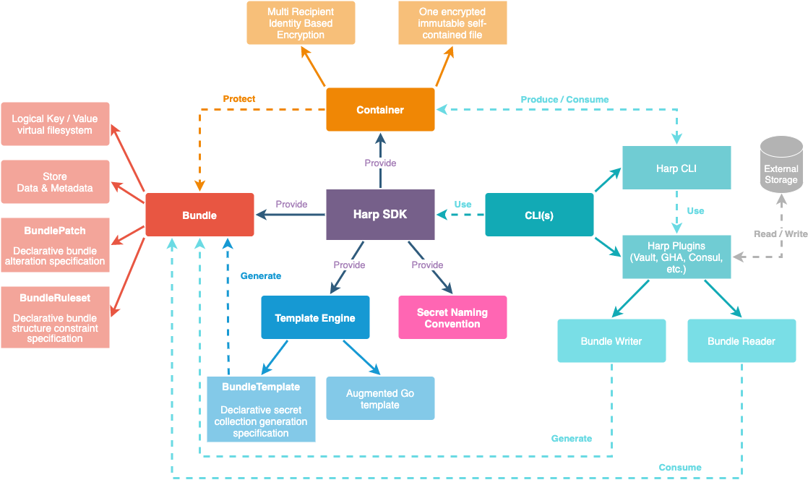
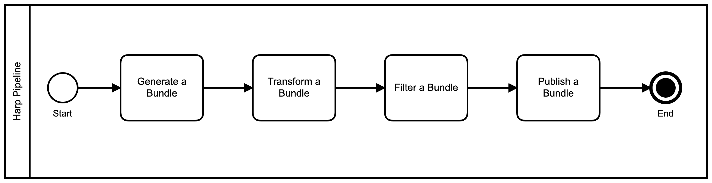
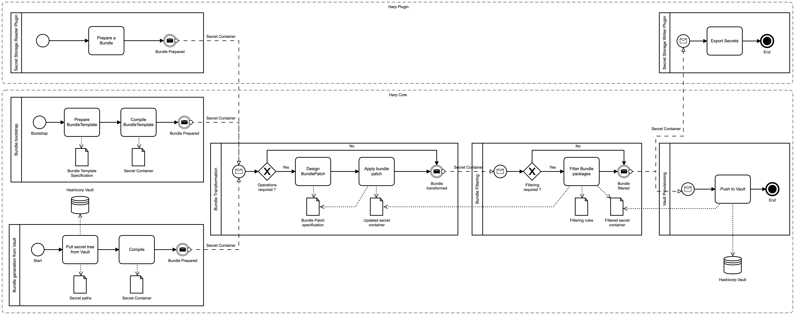

[](https://opensource.org/licenses/Apache-2.0)
[](https://goreportcard.com/report/github.com/elastic/harp)
[](http://golang.org)
[](https://github.com/elastic/harp/releases/)
[](https://github.com/elastic/harp/graphs/commit-activity)

- [Harp](#harp)
  - [TL;DR.](#tldr)
  - [Visual overview](#visual-overview)
  - [Why harp?](#why-harp)
  - [Use cases](#use-cases)
  - [How does it work?](#how-does-it-work)
    - [Like a Data pipeline but for secret](#like-a-data-pipeline-but-for-secret)
    - [Immutable transformation](#immutable-transformation)
  - [What can I do?](#what-can-i-do)
  - [FAQ](#faq)
  - [License](#license)
- [Homebrew install](#homebrew-install)
- [Build instructions](#build-instructions)
  - [Clone repository](#clone-repository)
  - [Manual dev environment](#manual-dev-environment)
    - [Check your go version](#check-your-go-version)
      - [Go 1.17/1.16](#go-117116)
      - [Go 1.18 (beta)](#go-118-beta)
    - [Install mage](#install-mage)
      - [From source](#from-source)
    - [Daily](#daily)
  - [With nix-shell](#with-nix-shell)
  - [Bootstrap tools](#bootstrap-tools)
  - [Docker](#docker)
    - [For Tools](#for-tools)
    - [For CLI](#for-cli)
- [Plugins](#plugins)
- [Community](#community)

# Harp

Harp is for Harpocrates (Ancient Greek: Ἁρποκράτης) the god of silence, secrets
and confidentiality in the Hellenistic religion. - [Wikipedia](https://en.wikipedia.org/wiki/Harpocrates)

## TL;DR.

Harp is a tool set to operate secret management by contract. The objective is
to reduce the value centric management by handling secret data in a
`reproducible` way by providing a technical stack to describe how your value is
managed by contracts and pipelines. Furthermore, we know that `naming thing is hard`,
as a consequence a secret could be `consistently` associated to a `predictable`
secret identifier used as a key to refer to the secret value. Finally, the secret
can hold additional metadata (ownership, rotation period, leak severity, etc.)
which can be consumed during the pipeline executions.

These key/value associations (path ⇒ value) form a `Bundle` stored in an
immutable file named a `Container`. This `Container` acts as a pivot format to
allow Harp commands to communicate and create data management pipelines.

In addition to that, it provides a `template engine` used to generate various
confidence values (password, passphrase, crypto keys, etc.) and allow more
sophisticated rendering operations (configuration files, etc.).

Finally, it provides a `SDK` to allow developers to integrate `Harp` features
in their products, and/or extend the Harp pipeline features by creating new
[plugins](#plugins).

## Visual overview



## Why harp?

* Secret management is in essence a collection of processes that must be
  auditable, executable and reproducible for infosec and operation requirements;
* Secret provisioning must be designed with secret rotation as a day one task,
  due to the fact that secret data must be rotated periodically to keep its
  secret property;
* `Developers` should negotiate secret value for the secret consumer they are
  currently developing, by the contract based on a path (reference to the secret)
  and a value specification (for code contract) without the knowledge of the
  final deployed value;
* `Secret Operators` use different set of tools to achieve secret
  management operation which increases the error/secret exposure probability due to
  tool count involved in the process (incompatibility, changes, etc.);
* Without a defined secret naming convention, the secret storage becomes difficult to
  handle in time (naming is hard) and secret naming could not be helped to
  get a consistent, reliable and flexible secret tree;
* Secret storage backend can use various implementations in different environments
  and should be provisioned consistently.

## Use cases

* You want to have a `single secret value` and you are asking yourself
  `how to generate a strong password` - Harp has a template engine with secret
  value generation functions to allow you to generate such values.
* You have `thousands secrets` to handle to deploy your platform/customers
  `on multiple cloud providers` with `different secret storages` - Harp will help you
  to define consistent secret provisioning bundles and pipelines.
* You need a `ephemeral secret storage` to `bootstrap` your long term cloud
  secret storage - Harp will help you to create
  secret containers that can be consumed on deployment.
* You want to `migrate massively` your secrets from one secret storage to
  another - Harp provides you a secret container to store these secrets while
  they are going to be distributed in other secret storage implementations.
* You have to `alter/modifiy` a secret (rotation/deprecation/renewal) - Harp
  provides you a `GitOps-able` secret `storage agnostic operation set`, so that you
  can define a specification to describe how your secret operation is going to
  be applied offline on the secret container.

## How does it work?



### Like a Data pipeline but for secret

`harp` allows you to handle secrets using deterministic pipelines expressed
using an atomic series of CLI operations applied to a commonly shared container
immutable and standalone file system used to store secret collection (Bundle)
generated from a template engine via user specification, or external secret
value coming from files or external secret storage.



These pipelines use the immutable container file system as a data exchange
protocol and could be extended for new input, intermediary operation or output
via plugins created with the `harp` SDK.

### Immutable transformation

Each applied transformation creates a container with transformed data inside.
This will enforce container reproducibility by eliminating cumulative
side effects applied to the same container.

The container handles for you the confidentiality and integrity protection applied
to the secret collection stored inside and manipulated by copy during the
pipeline execution.

## What can I do?

> New to harp, let's start with [onboarding tutorial](docs/onboarding/README.md) !
> TL;DR - [Features overview](FEATURES.md)

Harp provides :

* A methodology to design your secret management;
  * Secret naming convention (CSO);
  * A defined common language and complete processes to achieve secret management
    operations;
* A SDK to create your own tools to orchestrate your secret management pipelines;
  * A container manipulation library exposed as `github.com/elastic/harp/pkg/container`;
  * A secret bundle specification to store and manipulate secrets exposed as `github.com/elastic/harp/pkg/bundle`;
  * An `on-steroid` template engine exposed as `github.com/elastic/harp/pkg/template`
  * A path name validation library exposed as `github.com/elastic/harp/pkg/cso`
* A CLI for secret management implementation
  * CI/CD integration;
  * Based on human-readable definitions (YAML);
  * In order to create auditable and reproducible pipelines.
  * An extensible tool which can be enhanced via [plugins](https://github.com/elastic/harp-plugins).

And allows :

* Bundle level operations
  * Create a bundle from scratch / template / JSON (more via plugins);
  * Generate a complete bundle using a YAML Descriptor (`BundleTemplate`) to describe secret and their usages;
  * Read value stored in the K/V virtual file system;
  * Update the K/V virtual file system;
  * Reproducible patch applied on immutable container (copy-on-write);
  * Import / Export to Vault.
* Immutable container level operations
  * Seal / Unseal a container for integrity and confidentiality property conservation
    to enforce at-rest encryption (aes256-gcm96 or chacha20-poly1305);
  * Multiple identities sealing algorithm;

## FAQ

* Is it used internally at Elastic? - Yes. It is used to generate bootstrap
  secrets used to bootstrap the new region infrastructure components.
  #ChickenEggProblem

* Harp is only supporting `Vault`? - No, it has been published with only vault
  support built-in, but it supports many other secret storage implementations via
  plugins.

* What's the difference with `Vault`? - HashiCorp Vault is an encrypted highly
  available K/V store with advanced authorization engine, it doesn't handle
  secret provisioning for you. You can't ask Vault to generate secrets for your
  application and store them using a defined logic. Harp is filling this
  requirement.

## License

`harp` artifacts and source code is released under [Apache 2.0 Software License](LICENSE).

# Homebrew install

Download a [release](https://github.com/elastic/harp/releases) or build from source.

For stable version

```sh
brew tap elastic/harp
brew install elastic/harp/harp
```

# Build instructions

Download a [release](https://github.com/elastic/harp/releases) or build from source.

## Clone repository

```sh
$ git clone git@github.com:elastic/harp.git
$ export HARP_REPOSITORY=$(pwd)/harp
```

## Manual dev environment

### Check your go version

> Only last 2 minor versions of a major are supported.

#### Go 1.17/1.16

`Harp` is compiled with :

```sh
$ go version
go version go1.17.8 linux/amd64
```

> Simple go version manager - <https://github.com/stefanmaric/g>

#### Go 1.18 (beta)

Go 1.18 compilation is enabled for testing purpose and `golangci-lint` looks to
hang, so it has been disabled for the moment.

### Install mage

[Mage](https://magefile.org/) is an alternative to Make where language used is Go.
You can install it using 2 different methods.

#### From source

```sh
# Install mage
git clone https://github.com/magefile/mage
cd mage
go run bootstrap.go
```

### Daily

```sh
export PATH=$HARP_REPOSITORY/tools/bin:$PATH
# Build harp in bin folder
mage
```

## With nix-shell

Install `nix` on your system, if not already installed.

```sh
$ sudo install -d -m755 -o $(id -u) -g $(id -g) /nix
$ curl -L https://nixos.org/nix/install | sh
```

> More information? - <https://nixos.wiki/wiki/Nix_Installation_Guide>

```sh
$ cd $HARP_REPOSITORY
$ nix-shell
```

## Bootstrap tools

```sh
# Go to tools submodule
cd $HARP_REPOSITORY/tools
# Resolve dependencies
go mod tidy
go mod vendor
# Pull tools sources, compile them and install executable in tools/bin
mage
```

## Docker

### For Tools

You have to build this image once before executing artifact pipelines.

```sh
mage docker:tools
```

Or you can download `harp-tools` from GitHub registry

```sh
# Standard usecase
$ docker pull ghcr.io/elastic/harp/harp-tools:latest
# FIPS compliant go toolchain
$ docker pull ghcr.io/elastic/harp/harp-tools-fips:latest
```

Check image integrity with `cosign` and the public key `build/artifact/cosign.pub`

```sh
cosign verify --key build/artifact/cosign.pub ghcr.io/elastic/harp/harp-tools:latest

Verification for ghcr.io/elastic/harp/harp-tools:latest --
The following checks were performed on each of these signatures:
  - The cosign claims were validated
  - The signatures were verified against the specified public key
  - Any certificates were verified against the Fulcio roots.

[{"critical":{"identity":{"docker-reference":"ghcr.io/elastic/harp/harp-tools"},"image":{"docker-manifest-digest":"sha256:1be31528e7b00c9e836479aadfdf49319f3b4d7916e705c43ffd0b14965763a8"},"type":"cosign container image signature"},"optional":{"ref":"40714fef947d018e6053991f5ddb54283f466b04","repo":"elastic/harp","workflow":"Build and push docker tools"}}]
```

### For CLI

```sh
# or docker image [distroless:static, rootless, noshell]
mage docker:harp
# To execute in the container
docker run --rm -ti --read-only elastic/harp:<version>
```

# Plugins

You can find more Harp feature extensions - <https://github.com/elastic/harp-plugins>

# Community

Here is the list of external projects used as inspiration :

* [Kubernetes](https://github.com/kubernetes/)
* [Helm](https://github.com/helm/)
* [Open Policy Agent ConfTest](https://github.com/open-policy-agent/conftest)
* [SaltPack](https://github.com/keybase/saltpack)
* [Hashicorp Vault](https://github.com/hashicorp/vault)
* [AWS SDK Go](https://github.com/aws/aws-sdk-go)

