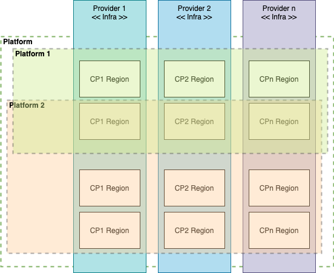
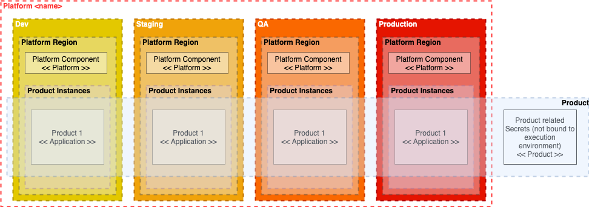
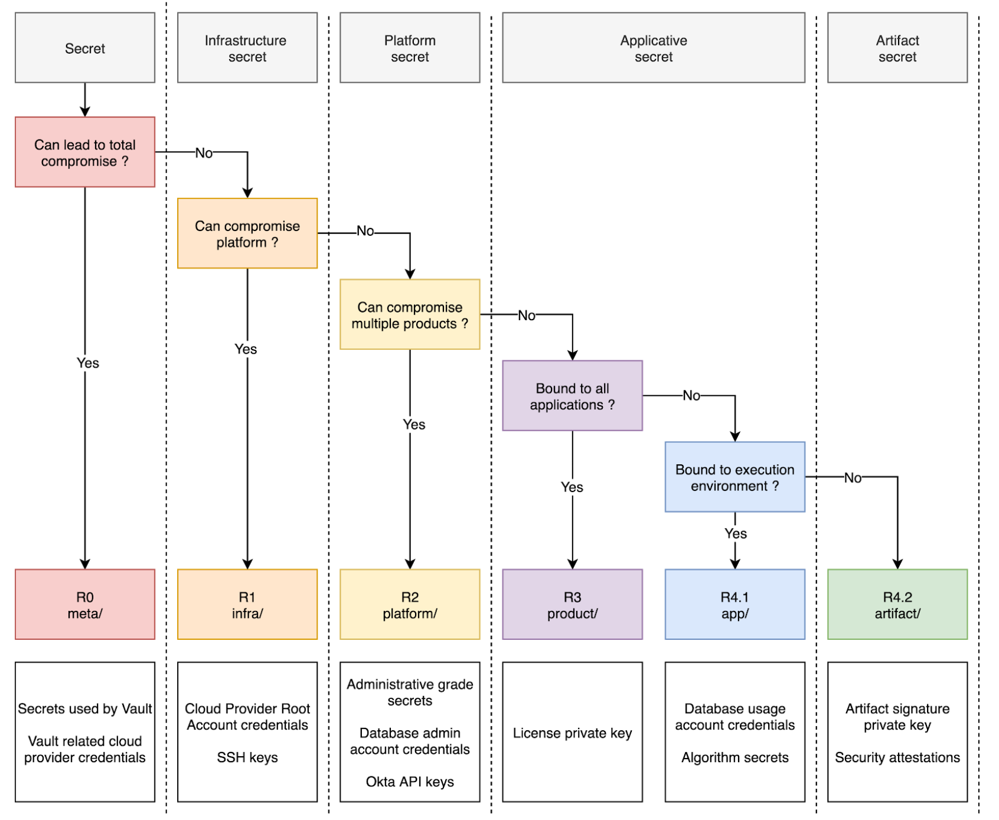
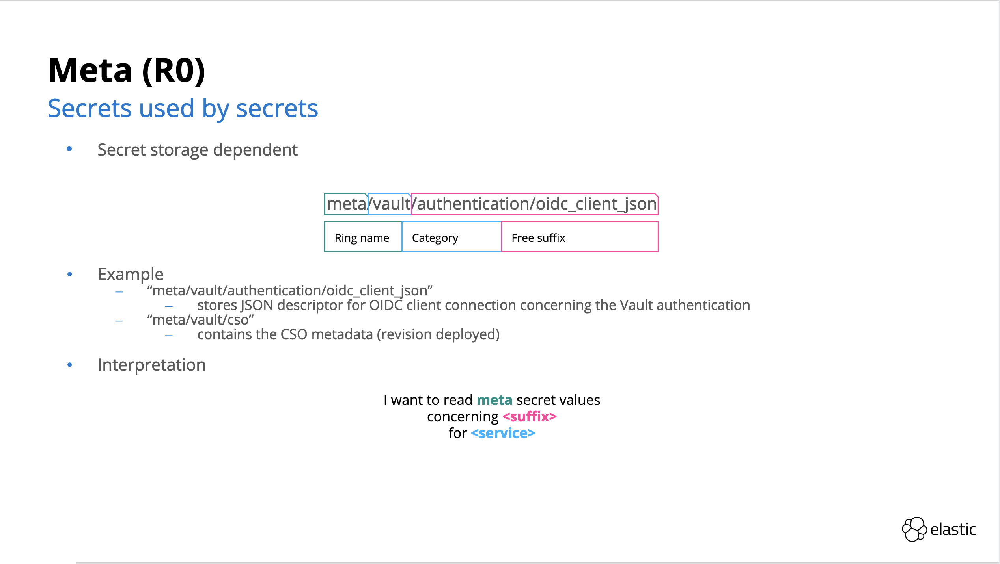
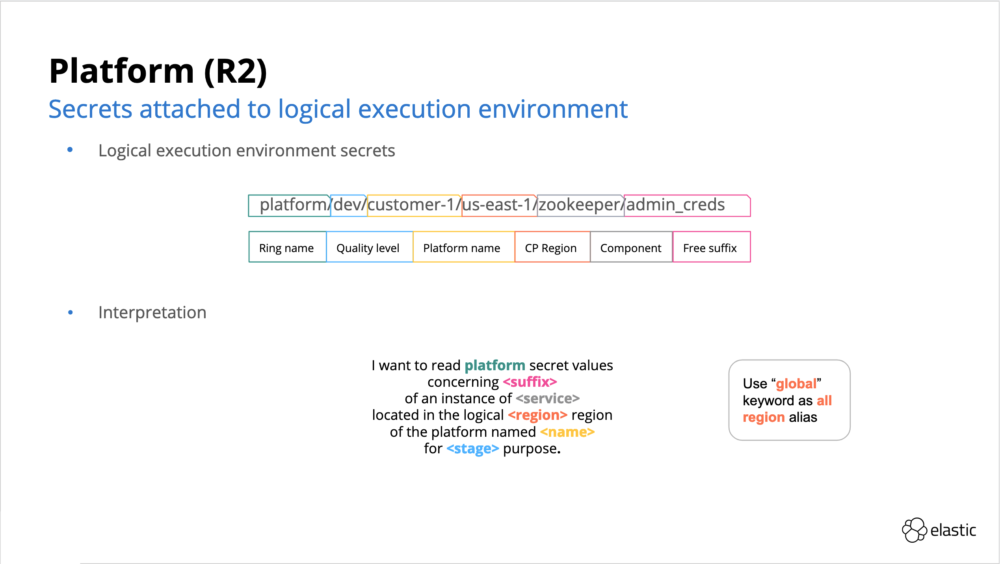
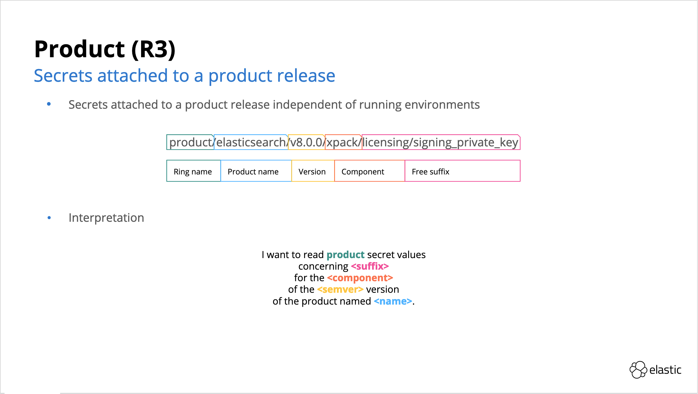
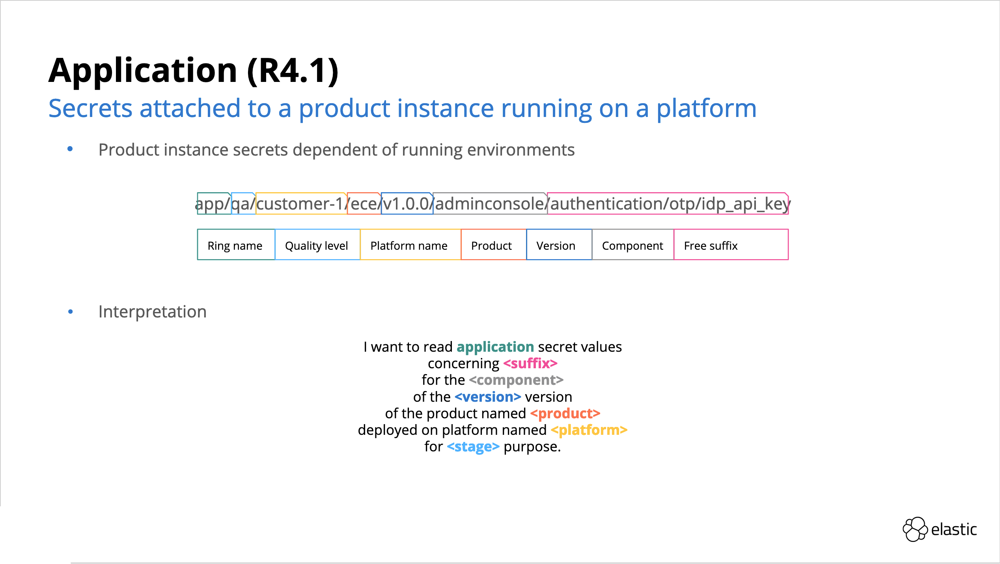
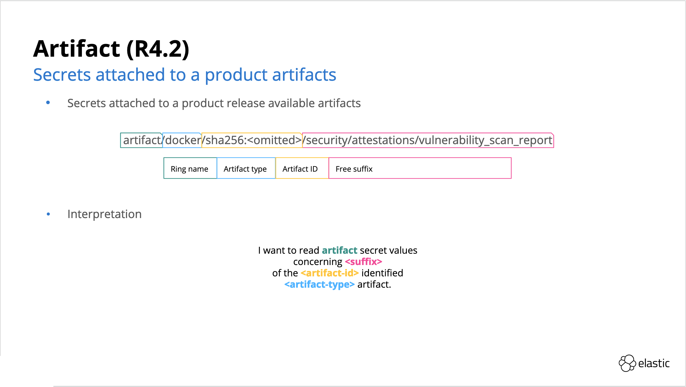

# Elastic Cloud Secret Organization

## Introduction

### Platform engineering

### Service engineering

## Decision Waterfall

## Rings

### R0 - Meta

### R1 - Infrastructure

### R2 - Platform

### R3 - Product

### R4.1 - Application

### R4.2 - Artifact

