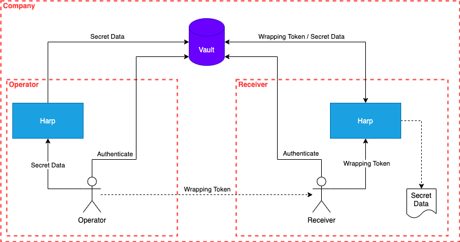

# Secret sharing

- [Secret sharing](#secret-sharing)
  - [Why](#why)
  - [Use cases](#use-cases)
  - [Simple](#simple)
    - [Publish a content](#publish-a-content)
    - [Retrieve the secret](#retrieve-the-secret)
  - [End-to-end encryption](#end-to-end-encryption)
    - [Publish a content](#publish-a-content-1)
    - [Receive the secret](#receive-the-secret)
  - [Ephemeral bundles](#ephemeral-bundles)
    - [Create and publish a bundle](#create-and-publish-a-bundle)
    - [Retrieve the bundle](#retrieve-the-bundle)

## Why

Sharing secrets is a complex topic because you can have some leaks due to
insecure transport media or something else.

Harp proposes a protocol based on `Hashicorp Vault` cubbyhole secret backend
and wrapping token usages.

It wraps everything to 2 simple commands :

* `harp share put` - To create an ephemeral wrapped token used to refer to the
  shared content
* `harp share get` - To retrieve the associated data attached to a wrapped token



## Use cases

* User-to-user secret exchange after password rotation;
* Machine-to-machine secret transport:
  * Jenkins master provisioning encrypted secrets as a wrapping token in Vault
    and consumed by a job without giving the job real access to secrets.

## Simple

### Publish a content

> The input content can be anything.

```sh
# Login to vault as operator
$ export VAULT_ADDR=https://vault.server.local:8200
$ export VAULT_TOKEN=$(vault login -method=iodc -token-only)
# Prepare the content to be shared
$ echo -n '{{ paranoidPassword }}'
    | harp template \
    | harp share put --ttl 180
Token : s.u0dP3MyrggEY807MmW4gRs3M (Expires in 180 seconds)
```

Send to `s.u0dP3MyrggEY807MmW4gRs3M` token to the requester (Slack, Keybase, etc.)

### Retrieve the secret

```sh
# Login as receiver
$ export VAULT_ADDR=https://vault.server.local:8200
$ export VAULT_TOKEN=$(vault login -method=iodc -token-only)
# Retrieve the secret data with the wrapping token
# Save the result to a temporary file. Due to burn-after-read behavior the token
# is usable only once.
$ harp share get \
    --token s.u0dP3MyrggEY807MmW4gRs3M \
    --out new-password
$ cat new-password
lLUjh0XpQzpAf6_82qm80%RsoHI<ZoV5%]okNzNV3J6q*WU]|hWgP)VkN>W4leAZ
```

## End-to-end encryption

In this sample, we are going to use `age` encryption tool - https://github.com/FiloSottile/age.

### Publish a content

The receiver shared its public key `age160j43tdp8k5yss3rxs8yf0j6gkupyngq989j5yfxuxn09ffetyksafe4d3` with the operator first.

```sh
# Login to vault as operator
$ export VAULT_ADDR=https://vault.server.local:8200
$ export VAULT_TOKEN=$(vault login -method=iodc -token-only)
# Prepare the content to be shared
$ echo -n '{{ paranoidPassword }}'
    | harp template \
    | age -r age160j43tdp8k5yss3rxs8yf0j6gkupyngq989j5yfxuxn09ffetyksafe4d3 -a \
    | harp share put --ttl 180
Token : s.2DJVYiHRcFhp6aijuH3KHbKb (Expires in 180 seconds)
```

### Receive the secret

As the receiver, you should have the `age` private key.
If you try to retrieve the secret without `age` decryption step, you will see this :

```sh
$ harp share get --token s.2DJVYiHRcFhp6aijuH3KHbKb
-----BEGIN AGE ENCRYPTED FILE-----
YWdlLWVuY3J5cHRpb24ub3JnL3YxCi0+IFgyNTUxOSBrV2s3L3BpdDg0UTExZk1P
S1JVa1dWNUxCbmMyejBTRWpyMmd1Zlh3ejA0CmMyOHZaM3oxWGQ0WXdYNHYvWDdH
Y2pWbnl3UnBVV2dWOEZvOXpXZHdVS1UKLS0tIDd3TVlLU1FjSHF1b2dVTHgrTVpR
YUt5NGpnbzJraHpWeTV4d3BYMFRrTFkKJh+GG/NbpQwpTp8j3VHWkY+C5tL9w8C/
vkPBLvo2I2Nw3XFhYqxp5/XGDO/4wYnL1FZhd5l0mz+amwp/H7drFEdYXURCkdsA
+ogVdQgeefxlxf/VCZ0Zw29dxMiDj5v1
-----END AGE ENCRYPTED FILE-----
```

You need to decrypt the content using your private key :

```sh
$ harp share get --token s.zCvElYThNiZ1JVLd6TzzziRx \
    | age -d -i $PRIVATE_KEY_FILE
Z8f:D|SV?4C1wdPNqQc_aGZhUF6FFeFEM5rPxW]0AGX(N*1ns/>OxKy22Z"XFFY5%
```

## Ephemeral bundles

### Create and publish a bundle

In this example, we are building a `Bundle` from a `BundleTemplate`, but you
can use any Bundle builder you have (Vault, etc.).

```sh
$ harp from template \
    --in customer-bundle/spec.yaml \
    --values customer-bundle/values.yaml \
    --set quality=production \
    | harp share put --ttl=180s
Token : s.753Hq2TNazjxfuVSennB063t (Expires in 180 seconds)
```

### Retrieve the bundle

```sh
$ harp share get --token=s.753Hq2TNazjxfuVSennB063t \
  | harp bundle dump --path-only
app/production/customer1/ece/v1.0.0/adminconsole/authentication/otp/okta_api_key
app/production/customer1/ece/v1.0.0/adminconsole/database/usage_credentials
app/production/customer1/ece/v1.0.0/adminconsole/http/session
app/production/customer1/ece/v1.0.0/adminconsole/mailing/sender/mailgun_api_key
app/production/customer1/ece/v1.0.0/adminconsole/privacy/anonymizer
app/production/customer1/ece/v1.0.0/userconsole/database/usage_credentials
app/production/customer1/ece/v1.0.0/userconsole/http/certificate
app/production/customer1/ece/v1.0.0/userconsole/http/session
infra/aws/essp-customer1/us-east-1/rds/adminconsole/accounts/root_credentials
platform/production/customer1/us-east-1/billing/recurly/vendor_api_key
platform/production/customer1/us-east-1/postgresql/admiconsole/admin_credentials
platform/production/customer1/us-east-1/zookeeper/accounts/admin_credentials
product/ece/v1.0.0/artifact/signature/key
```
